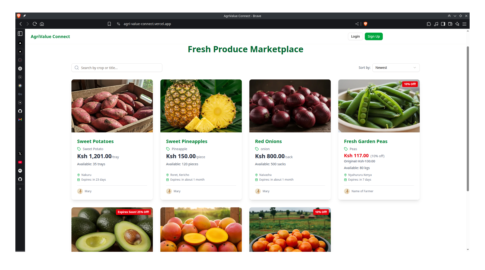
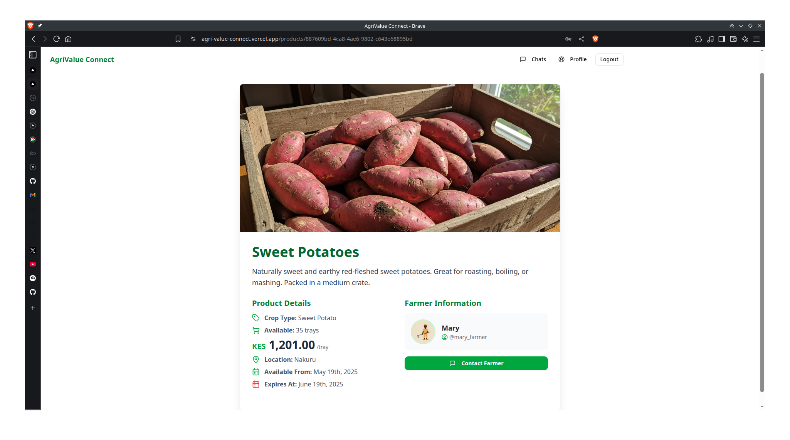
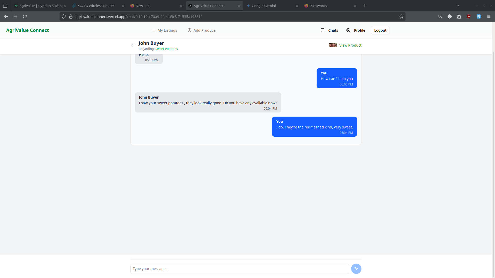
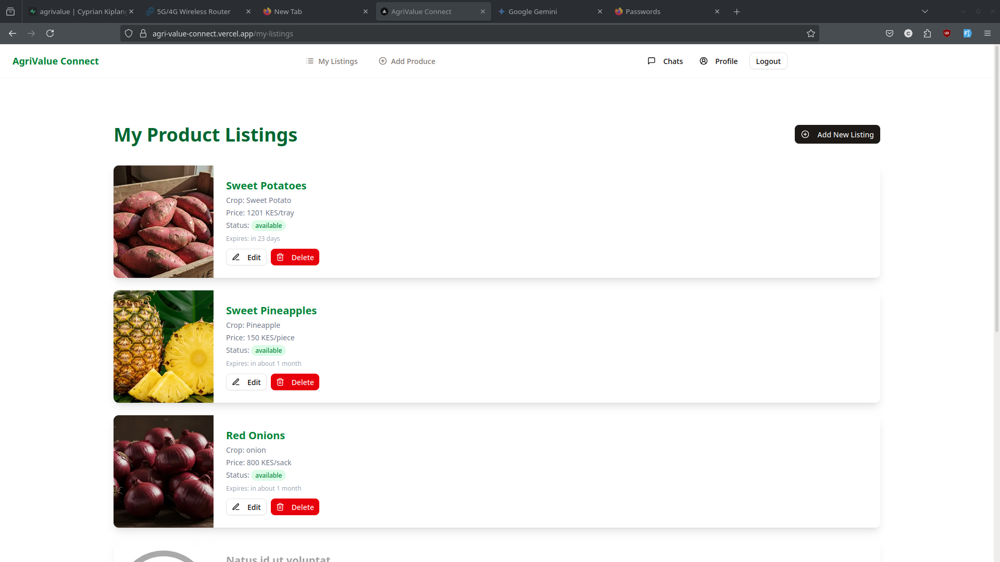

# AgriValue Connect

**Tagline:** Connecting Farmers with Buyers for Perishable Goods, Reducing Waste and Maximizing Value.

## Problem Statement

In Kenya, a significant portion of perishable agricultural produce is lost post-harvest due to a lack of timely market access and logistical challenges. Farmers struggle to connect with buyers quickly, especially for goods nearing their sell-by date, leading to financial loss and food waste. AgriValue Connect aims to bridge this gap by providing a platform for farmers to list their perishable goods and for buyers to easily find and purchase fresh produce, including timely discounted offers.

## Core Features

*   **User Authentication & Profiles:** Secure sign-up and login for Farmers and Buyers. Users can manage their profiles (name, location, contact, role-specific details like crops grown or buyer type).
*   **Product Listings (Farmers):**
    *   Farmers can create detailed listings for their produce: crop type, description, quantity, price, harvest date, expiry date, location, and images.
    *   Manage existing listings (view, edit, delete).
*   **Product Browsing & Search (Buyers):**
    *   Buyers can browse available product listings.
    *   Search by crop type or title.
    *   Sort listings (e.g., by newest, nearing expiry).
    *   View detailed product information and farmer profiles.
*   **Real-time Chat:**
    *   Buyers can initiate chats with farmers directly from product listings.
    *   Real-time messaging between buyers and farmers.
    *   Users can view a list of their ongoing conversations.
*   **Dynamic Discounting:** (Conceptual, visual cues implemented)
    *   Products nearing their expiry date are highlighted.
*   **Dark Mode:** User-selectable dark theme for improved accessibility and viewing comfort.

## Tech Stack

*   **Frontend:** Next.js (App Router) with TypeScript
*   **Backend & Database:** Supabase (PostgreSQL, Auth, Realtime Database, Storage)
*   **UI Components:** shadcn
*   **Styling:** Tailwind CSS
*   **Forms:** React Hook Form with Zod for validation
*   **Date Management:** `date-fns`
*   **Icons:** Lucide React
*   **Deployment:** Vercel

## Getting Started

### Prerequisites

*   Node.js (v22 or later recommended)
*   pnpm 
*   A Supabase project.

### Setup

1.  **Clone the repository:**
    ```bash
    git clone https://github.com/mutaician/agri-value-connect.git
    cd agri-value-connect
    ```

2.  **Install dependencies:**
    ```bash
    pnpm install
    ```

3.  **Set up environment variables:**
    *   Create a `.env.local` file in the root of the project.
    *   Add your Supabase project credentials:
        ```env
        NEXT_PUBLIC_SUPABASE_URL=your_supabase_project_url
        NEXT_PUBLIC_SUPABASE_ANON_KEY=your_supabase_anon_key
        ```

4.  **Set up Supabase database:**
    *   Go to your Supabase project dashboard.
    *   Navigate to the SQL Editor.
    *   Run all the commands from `ai-assisted/commands.sql` to create the necessary tables, functions, triggers, and Row Level Security (RLS) policies.
    *   Create a storage bucket named `product-images`:
        *   Go to Storage in your Supabase dashboard.
        *   Click "New bucket".
        *   Name it `product-images` and make it public.

5.  **Configure Next.js for your Supabase project:**
    *   Update the `hostname` in `next.config.js` to match your Supabase project URL:
        ```javascript
        // Replace 'doxlkmrsisnxlvbjojjg.supabase.co' with your actual Supabase project hostname
        hostname: 'your-project-ref.supabase.co',
        ```

6.  **Initialize `shadcn` (if needed for further component additions):**
    ```bash
    pnpm dlx shadcn@latest init
    ```
    (Follow the prompts, ensuring it aligns with the existing setup if you are just adding components.)


7.  **Run the development server:**
    ```bash
    pnpm dev
    ```
    Open [http://localhost:3000](http://localhost:3000) with your browser to see the result.

## Deployment

This project is optimized for deployment on [Vercel](https://vercel.com/).

1.  Push your code to a GitHub repository.
2.  Import the project into Vercel.
3.  Configure the following environment variables in your Vercel project settings:
    *   `NEXT_PUBLIC_SUPABASE_URL`
    *   `NEXT_PUBLIC_SUPABASE_ANON_KEY`
4.  Vercel will automatically build and deploy your application.

## Live Demo

https://agri-value-connect.vercel.app/

## Screenshots in case live demo no longer works

<table>
  <tr>
    <td width="50%">
      
    </td>
    <td width="50%">
      
    </td>
  </tr>
  <tr>
    <td width="50%">
      
    </td>
    <td width="50%">
      
    </td>
  </tr>
</table>

